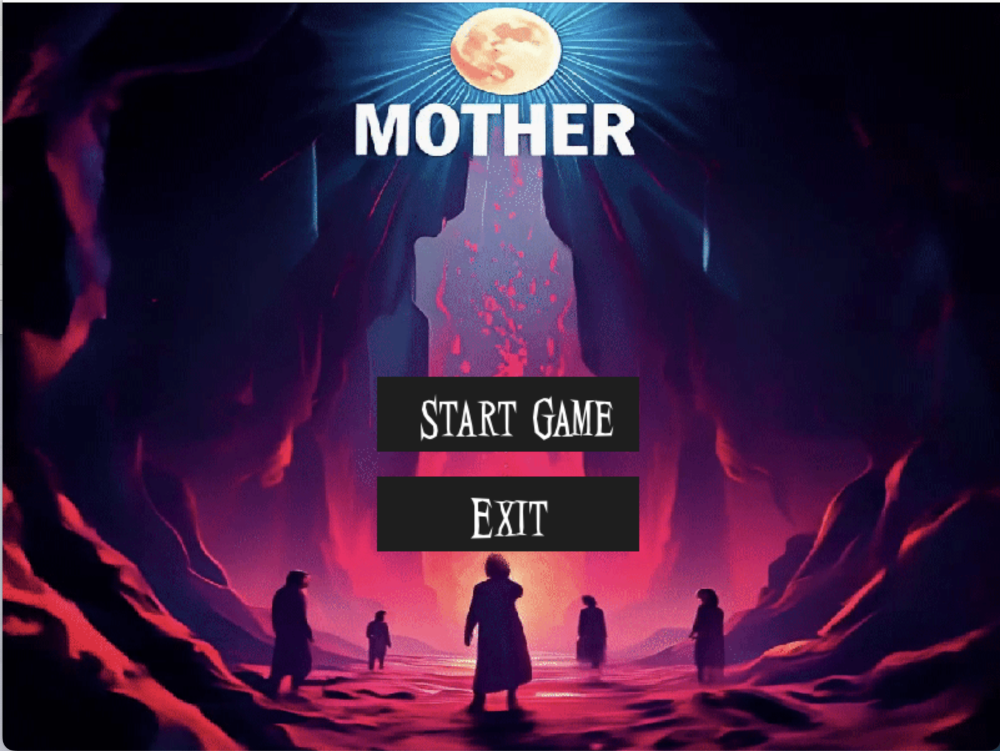
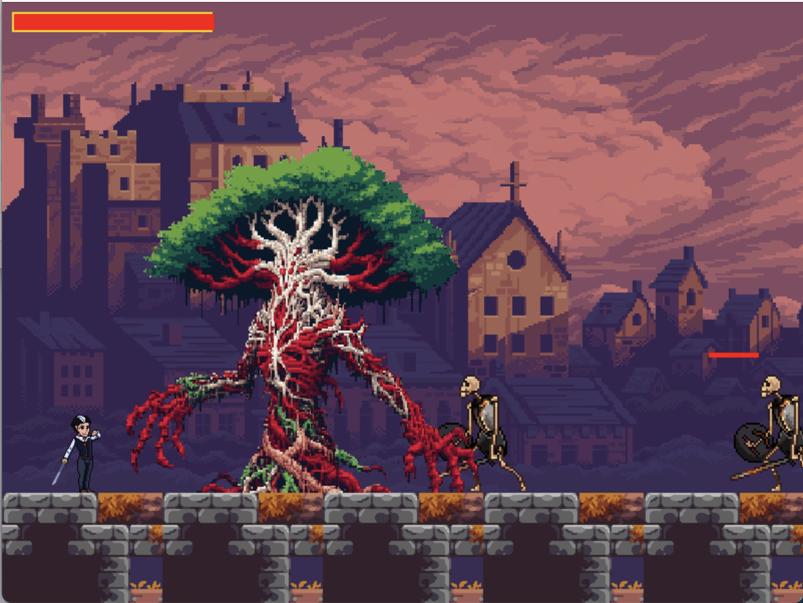
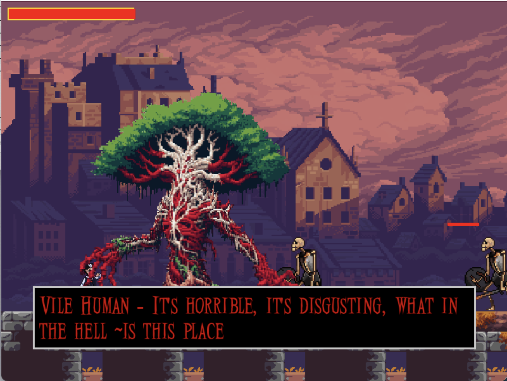
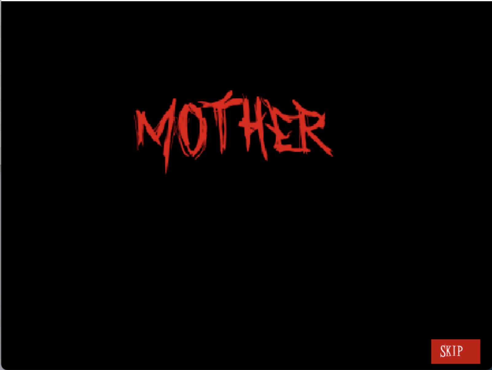
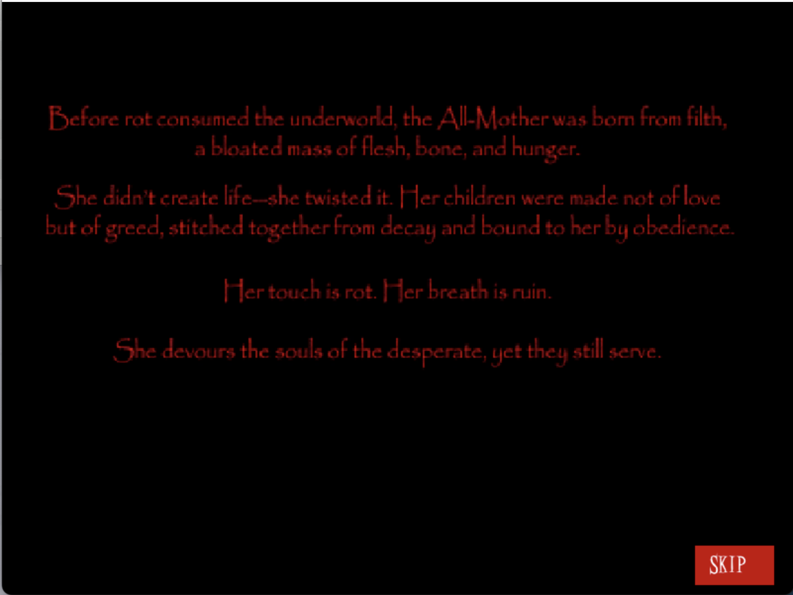
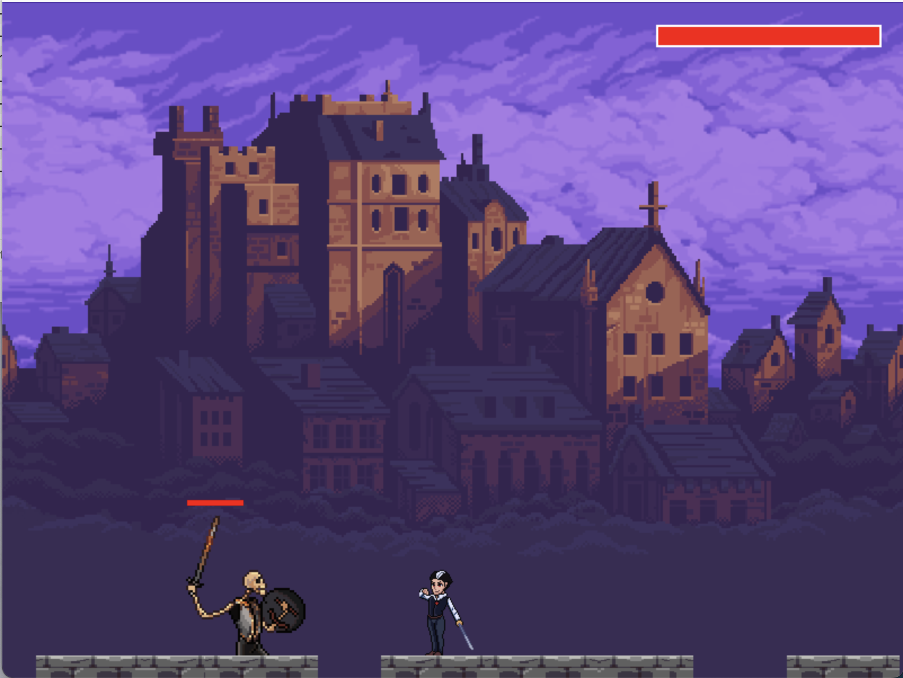
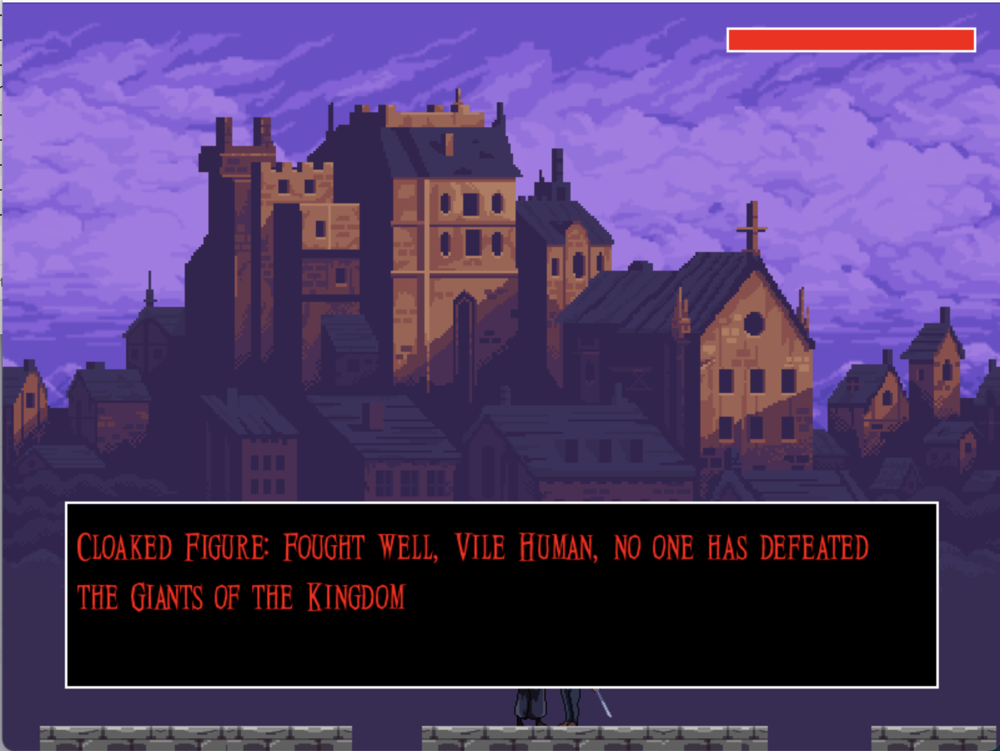
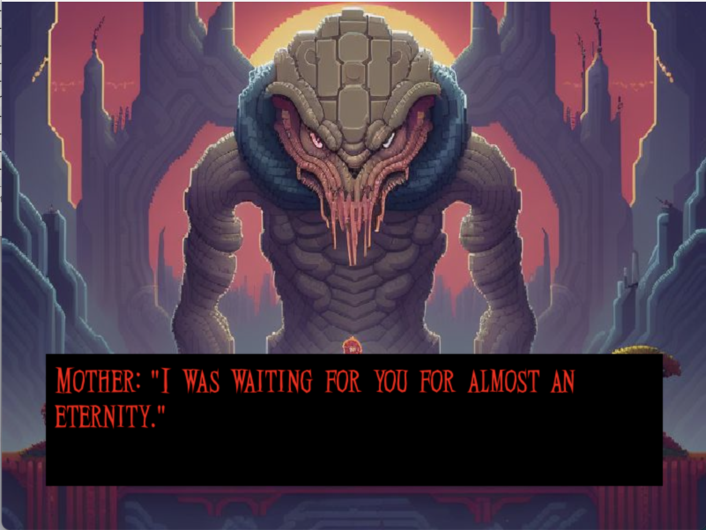
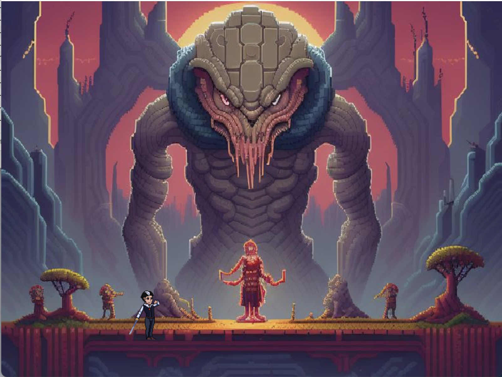

## Mother-2D-using-pygame

##### Mother is a 2D horror platformer that blends story-driven dialogue, atmospheric pixel art, and responsive controls into a haunting experience. Players assume the role of a Vile human journeying through an underworld filled with mini-bosses and peculiar NPCs, each encounter revealed through a dynamic conversation engine. Custom-made pixel art, a smooth 60 FPS architecture, and state-driven interactions create a fluid, immersive gameplay loop. As the player struggles to reunite with their mother, every step offers narrative depth and tension, encouraging longer, more engaged play sessions.

1. Project Structure

/Mother  
 ├── Assets/  
 │   ├── artwork/  
 │   ├── characters/ 
 │   ├── fonts/  
 │   ├── Music/
 │   ├── terrain
 │ 
 ├── all project files  
 ├── game_screenshots/  
 ├── README.md  

2. Core Mechanics & Features

-->Linear movement and platforming with tight jump physics with 60 FPS for a polished experience.
-->NPCs & enemies react based on the player's choices.
-->Multi-branch dialogue system for story-rich encounters.

Visuals & Animation:
-->Custom pixel art with eerie environmental storytelling from itch.io customized using LibreSprite

Mini-Boss Battles:
-->Each mini-boss has unique attack patterns and weaknesses.

3. Technical Setup

Engine & Frameworks:
-->Pygame for game rendering with multi-branch dialogue system.
-->State machine for AI behavior.

Narrative & Progression:
-->The player unravels a cryptic story through dialogue.
-->Multiple endings based on player decisions.

